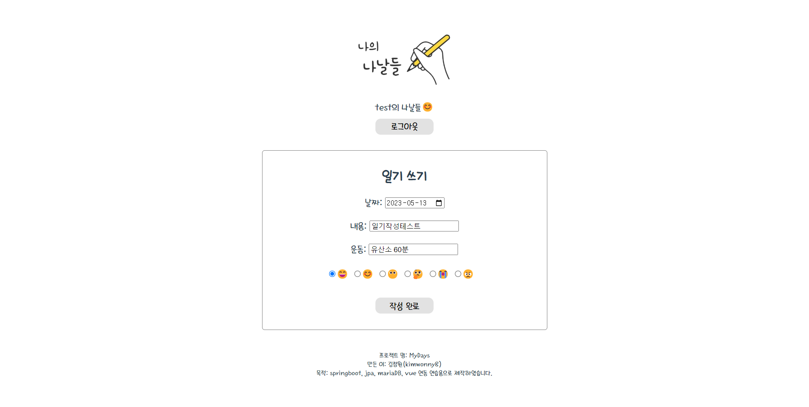

# MyDays-springboot

### 🔸개발 시기

- 2023년 1~2월

### 🔸 사용 기술 및 개발 환경

- Window
- Intelli J
- Visual Studio Code
- Vue2
- Axios
- Java 18
- Spring Boot 2.7.8
- Spring Security
- Jpa
- MariaDB

### 🔸기획 배경

- [Vue 공부할 때 만들어 둔  프로젝트](https://github.com/kimwonny8/Vue-Diary)에 서버를 추가해서 완성하고 싶었음
- SpringBoot 공부도 하며 완성해본 프로젝트

***

### 📌 실행화면

#### 로그인

#### 회원가입

#### 메인 페이지

#### 일기 쓰기

#### 일기 쓰기 후 캘린더에 표시

#### 내용 수정 또는 삭제

#### 리스트로 보기

#### 플러스 버튼 클릭시 10개씩 추가

