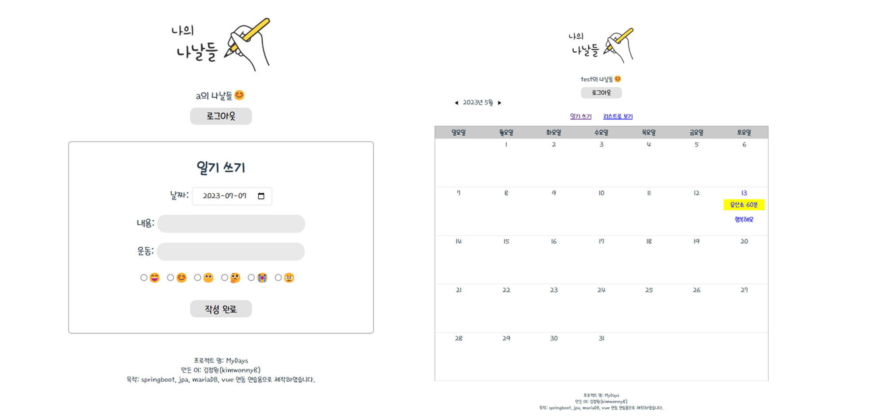

# MyDays-springboot

## 🔸개발 시기

- v1.0 (2023-01 ~ 02)
- v2.0 (2023-05-14 ~ 2023-05-26)
  - spring security, jwt, 비밀번호 암호화
- 배포 2023-06
  - 일주일 정도 배포 후 요금 문제로 삭제(2023-06-15)
  
 

##  🔸사용 기술

- Window, Intelli J, Visual Studio Code
- Vue2, Axios
- Java 17, Spring Boot 2.7.8, Spring Security, jpa, jwt
- MariaDB
- Amazon ec2, rds, s3, route53, load balancer, cloud front, code deploy, certificate mangager

 

## 🔸기획 배경

- [Vue 공부할 때 만들어 둔 프로젝트](https://github.com/kimwonny8/Vue-Diary)에 서버를 추가해서 완성하고 싶어서 기획한 일기장입니다.
- SpringBoot 공부을 하며 진행해본 프로젝트이며, 이 후 Spring Security, JWT 를 공부해보며 버전 업그레이드를 하였고, CI/CD 구축까지 경험하는 것을 목표로 진행했습니다.

 

## 🔸주요 기능

- 로그인, 회원가입
  - 비밀번호 암호화
  - refresh token, access token 발행
- 다이어리 조회(리스트/캘린더)
- 다이어리 작성 및 수정 삭제

 

## 🔸실행 화면

### 메인 - 회원 가입과 로그인

- JWT 토큰과 Spring Security를 이용하였으며, 로그인시 Access Token과 Refresh Token 이 발급됩니다.
- 액세스 토큰은 만료 시간을 짧게 주어 Vuex에 저장 관리하였고, Refresh Toekn 은 Http Only 로 쿠키와 DB에 저장되게 하였습니다.

- 로그인 후 모든 axios 요청에 header로 Access Token을 담아 보냈고, 401 에러 발생시 Refresh Token으로 재발급을 받았습니다.
- 해당 메소드는 모든 메소드에 적용되기 때문에 Vuex를 이용했습니다.

### 메인 - 캘린더

- 해당 페이지에서 날짜를 골라 읽을 수 있고, 새로 작성할 수 있으며 리스트 형태로 바꿔 볼 수도 있습니다.

### 일기 작성

- 날짜와 기분, 운동 여부를 표시할 수 있습니다.

### 일기 조회

- 내용을 읽을 수 있으며, 수정 삭제가 가능합니다.

